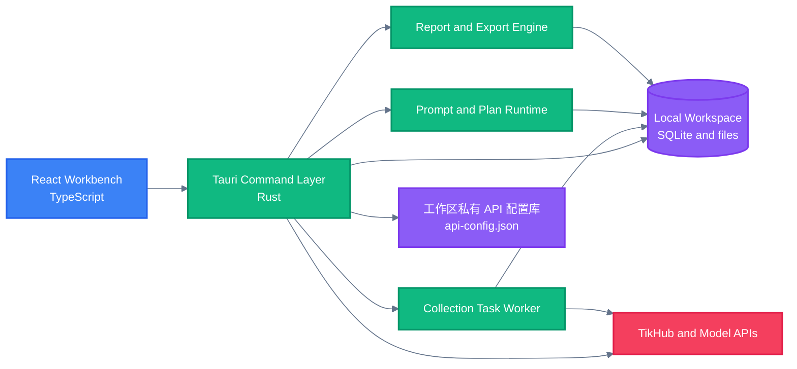

<!-- BEAUTIFIED -->

<div align="right">

<a href="README.md">English</a> · 中文

</div>

<p align="center">
  
</p>

<h1 align="center">Sortlytic</h1>

<p align="center">
  <strong>用于采集、整理、校验和导出公开社交平台研究数据的本地优先 macOS 工作区。</strong>
  <br />
  <em>TikTok · 抖音 · 小红书 · 结构化工作流 · XLSX 与 PDF 导出</em>
</p>

<p align="center">
  <a href="#快速开始"></a>
  <a href="https://github.com/ljiulong/sortlytic/releases/latest"></a>
</p>

<p align="center">
  <a href="https://github.com/ljiulong/sortlytic/actions/workflows/ci.yml"></a>
  <a href="https://github.com/ljiulong/sortlytic/releases"></a>
  
</p>

<p align="center">
  
  
  
  
  
</p>

## 功能特性

| 能力 | 作用 |
|---|---|
| 多平台采集 | 组合 TikTok、抖音和小红书的关键词搜索、内容详情、账号资料、账号作品与评论用户五类 TikHub 能力。 |
| 受控任务执行 | 采集前和采集中校验实时接口报价、免费额度、充值余额、请求上限、记录上限与任务预算。 |
| 自然语言计划 | 通过当前本地规则解析器把中文研究意图转换成经过校验的采集计划，同时保存运行快照。 |
| 提示词治理 | 保存提示词模板与版本，绑定输出 Schema，并在内置回归样例失败时阻止版本激活。 |
| 本地优先安全 | TikHub 与 AI API 配置和明文凭据统一写入当前工作区私有 `secrets/api-config.json`，SQLite 只保留可重建镜像与密钥引用元数据。 |
| 可审计交付 | 生成报告快照、执行导出完整性校验，并输出带哈希和任务历史的 Excel 工作簿与 PDF 报告。 |

## 快速开始

### 下载 macOS 应用

1. 打开 [GitHub 最新版本页面](https://github.com/ljiulong/sortlytic/releases/latest)。
2. 通过 **苹果菜单 → 关于本机** 查看芯片架构，也可以在终端运行 `uname -m`。
3. Apple 芯片（`arm64`）下载文件名以 `_aarch64.dmg` 结尾的安装包；Intel 芯片（`x86_64`）下载以 `_x64.dmg` 结尾的安装包。`.app.tar.gz` 和 `.sig` 是应用内更新产物，不是常规安装包。
4. 打开 DMG，把 Sortlytic 拖入**应用程序**，推出磁盘映像，再从“应用程序”目录启动 Sortlytic。

当前发版工作流尚未接入 Apple Developer ID 签名与公证。覆盖任何 macOS 安全警告前，请先阅读[首次打开与“已损坏”提示](#首次打开与已损坏提示)。

### 从源码启动

源码开发需要 macOS、Node.js 24、通过 Corepack 使用的 pnpm 11.5.2，以及 Rust 1.88 或更高版本。

```bash
git clone https://github.com/ljiulong/sortlytic.git
cd sortlytic/apps/macos
corepack enable
corepack install
pnpm install --frozen-lockfile
pnpm tauri dev
```

如果只需预览界面，不连接原生后端，可运行：

```bash
pnpm dev
```

浏览器预览使用演示数据，不能访问工作区私有 API 配置、执行原生采集任务、创建本地导出文件或安装应用更新。

## 使用方法

### 首次打开与“已损坏”提示

当前 `v0.1.5` 版本包含 Tauri updater 更新包签名，但 GitHub Actions 工作流还没有配置 macOS Gatekeeper 所需的 Apple Developer ID 证书和公证凭据。Tauri 文档说明，从浏览器下载的 macOS 应用需要代码签名，才能避免“应用已损坏，无法打开”警告。updater 签名用于校验 Sortlytic 应用内下载的更新产物，不能替代 Apple 代码签名和公证。

如果 macOS 出现截图中的提示：

1. 删除被拒绝的副本，从 [Sortlytic 官方 Releases 页面](https://github.com/ljiulong/sortlytic/releases)重新下载正确的 DMG，不要使用镜像站或聊天转发文件。
2. 确认 Apple 芯片对应 `_aarch64.dmg`，Intel 芯片对应 `_x64.dmg`。
3. 尝试打开一次 Sortlytic，然后进入**系统设置 → 隐私与安全性**。如果出现**仍要打开**，仅在确认下载来源后使用。Apple 说明，这个例外入口通常会在尝试启动后保留约一小时。
4. 如果系统仍报告应用损坏或没有显示**仍要打开**，并且已经确认应用来自官方 Release，可以只移除 Sortlytic 的隔离属性，再重新启动：

   ```bash
   xattr -dr com.apple.quarantine "/Applications/Sortlytic.app"
   open "/Applications/Sortlytic.app"
   ```

   这两条命令不会全局关闭 Gatekeeper，只会移除当前应用包的下载隔离属性。通常不需要 `sudo`；如果终端提示 `Permission denied`，只对 `xattr` 命令加一次 `sudo` 后重试。
5. 如果定向移除隔离属性后仍无法打开，请删除应用并重新核对芯片架构和下载完整性。应改用源码启动或等待完成 Developer ID 签名与公证的版本，不要执行 `sudo spctl --master-disable` 等全局绕过命令。

安全机制与发版要求可参考 [Apple Gatekeeper 指南](https://support.apple.com/zh-cn/102445)和 [Tauri macOS 签名指南](https://v2.tauri.app/zh-cn/distribute/sign/macos/)。

### 界面导航

| 区域 | 用途 |
|---|---|
| 工作台 | 创建计划、确认采集、跟踪任务状态、检查数据与证据，以及导出交付文件。 |
| 设置 | 查看本地工作区，配置 TikHub 和模型供应商，重新测试连接并安装更新。 |
| 使用指南按钮 | 点击右上角书本图标，查看 TikHub 注册、Token、域名、成本和安全说明。 |
| 主题按钮 | 切换明暗主题，偏好会保存在本机。 |

### 配置 TikHub

真实采集依赖 TikHub。创建任务前应先注册并验证账号：

1. [注册 TikHub 账号](https://user.tikhub.io/register)，完成邮箱验证，再[登录用户中心](https://user.tikhub.io/login)。
2. 在用户中心创建 API Token，并在显示时立即复制；使用付费端点前先查看 [TikHub 价格说明](https://tikhub.io/pricing)。
3. 在 Sortlytic 中打开**设置 → 配置 TikHub API**。
4. 选择域名，粘贴 Token，然后点击**保存并测试**。

| 网络环境 | API 域名 |
|---|---|
| 国际网络 | `https://api.tikhub.io` |
| 中国大陆网络 | `https://api.tikhub.dev` |

测试成功后，界面会显示脱敏账号邮箱、充值余额、免费额度、可用额度合计和邮箱验证状态。Token 以明文写入当前工作区私有 `secrets/api-config.json`，SQLite 只保存可重建镜像与带作用域的密钥引用。第一条测试成功的 TikHub 配置会自动成为当前配置；后续新增配置不会替换当前配置，需要在列表中显式选择**设为当前**。编辑已有配置时，可以把 Token 输入框留空以复用已保存 Token。

首次采集建议只设置 10～50 条记录，先检查平台、数据类型、国家或地区、关键词和端点成本，再逐步扩大任务。

### 配置 AI API（可选）

打开**设置 → 配置 AI API**，可以保存多条 OpenAI、Anthropic、Gemini、自定义 OpenAI-compatible 或 Ollama 配置，并在脱敏列表中查看和切换当前配置。选择 API 格式，按需填写 Base URL，再填写默认模型 ID 和 API Key；Ollama 可以不填密钥，编辑其他已有配置时可以把 API Key 留空以复用。API Key 与配置统一保存在当前工作区私有 `secrets/api-config.json`。

当前 MVP 不要求配置 AI API。AI 配置只做保存、完整性校验、查看和当前配置切换，不发起真实模型请求；自然语言计划仍使用 `local-rule-engine/rule-parser-v1`，基于供应商模型的计划生成和真实模型推理尚未接入。

### 创建并确认采集计划

打开**工作台 → 采集创建**，选择一种入口：

| 方式 | 适用场景 | 需要重点检查 |
|---|---|---|
| 表单式 | 已明确平台、数据类型、国家或地区、关键词、可选人群筛选、记录数和预算。 | 生成计划前确认每个字段。 |
| 自然语言 | 希望用中文描述调研目标，再由本地解析器整理成结构化计划。 | 检查推断的平台、数据类型、筛选条件、缺失条件、记录上限和预算。 |

表单支持 TikTok、抖音和小红书，可多选五类目标数据：关键词搜索账号、作品或笔记作者、账号公开信息、所采集作品的所属账号、评论用户。系统以关键词作为入口，自动补齐所需下游步骤；只承担依赖传递的搜索结果不计入最终数量。

| 筛选条件 | 行为 |
|---|---|
| 国家或地区 | 在单一下拉框中按中文名称或两位代码搜索，保存值为代码。不支持地区参数的步骤不会收到该参数；所选步骤全部不支持时禁用选择器。 |
| 年龄 | 可选的 0～130 岁闭区间。只接受 TikHub 或公开资料明确返回的年龄；启用筛选时，未知或格式异常的年龄会被排除。 |
| 性别 | 可选的多选筛选。只接受 TikHub 或公开资料明确返回的性别，不根据姓名、头像、简介或内容推断。 |

单任务记录数范围为 10～5,000 条筛选合格且去重后的账号行，成本上限可填写 1～500。账号优先按“平台 + 平台用户 ID”去重，缺少稳定 ID 时回退到规范化账号标识。

点击**生成计划**或**解析为计划**后：

1. 检查计划预览，重点核对平台、目标数据类型、受支持的筛选条件、合格记录上限、请求估算、实时报价和金额上限。
2. 处理**确认运行**旁显示的第一条阻塞原因。筛选无效、参数不受支持、价格未知、余额未知、可用额度不足或超出预算都会阻止确认。
3. 点击**确认运行**。生成计划本身不会开始正式付费采集；确认后任务才会进入本地队列。
4. 在**任务队列**中跟踪状态。可能出现已排队、运行中、等待确认、部分成功、成功和失败等状态。单个目标失败不会中止其他目标；存在合格结果且部分目标失败时，任务以“部分成功”结束。

### 检查结果与证据

在**数据资产**中选择一条记录，右侧面板会展示来源链接、证据摘要、校验状态、置信度、模型运行和转换理由。标记为**待人工确认**或**证据不足**的记录，应在进入报告前人工复核。

当前 MVP 边界：原生任务执行与原始记录存储已经实现，但工作台的真实记录查询尚未接通。因此，在打包应用的后端会话中，任务运行后**数据资产**仍可能为空；浏览器预览中的记录属于演示数据，不是真实采集结果。

### 导出 Excel 与 PDF

1. 至少创建一个采集任务。
2. 在右侧**导出中心**点击**执行导出检查**。
3. Sortlytic 会生成报告快照、校验导出请求，并分别创建 XLSX 与 PDF 任务。
4. 两项均显示**已通过**后，根据**Excel 工作簿**和**PDF 报告**下方显示的路径定位文件。

文件保存在当前工作区中：

```text
default-workspace/
├── app.sqlite
├── raw/tikhub/
├── reports/
├── exports/excel/
└── exports/pdf/
```

XLSX 账号导出遵循 `excel/社交平台用户数据收集模板_国家地区版.xlsx`，只保留模板中的`用户数据收集表`、`填写说明`、`字段枚举`和`资料依据`四个工作表，严格保持 18 列账号结构，年龄写为数值，并至少保留 200 行带格式的数据区。结果超过 200 条时会继续扩展公式、样式和数据校验。原始响应和逐目标失败保存在本地证据库与运行日志中，不增加到工作簿。

当前 PDF 写入器只生成简要摘要，并提示读者到工作簿查看完整结构化数据。界面中的 **Webhook 摘要**尚未启用，不会发送数据。

### 更新应用

打包版本可以通过**设置 → 自动更新**更新：

1. 点击**检查更新**。
2. 查看版本号与更新说明。
3. 点击**下载并重启**。Sortlytic 会校验 Tauri updater 更新产物签名，安装更新并重新启动。

浏览器预览没有更新权限。Apple Developer ID 签名与公证和 updater 签名校验是两套机制，仍需接入发版工作流。

### 常见问题

| 现象 | 检查方法 |
|---|---|
| “Sortlytic 已损坏，无法打开” | 从官方 Release 重新下载匹配架构的 DMG，再按[首次打开与“已损坏”提示](#首次打开与已损坏提示)处理。 |
| TikHub 测试失败 | 检查 Token 是否完整、邮箱是否已验证、域名是否适合当前网络，以及账号额度是否足够。 |
| **保存并测试**不可点击 | 新 TikHub Token 至少需要 8 个字符；已有 Token 可以留空复用。 |
| 旧配置显示**需重新输入** | 新版本只导入旧 SQLite 中的非敏感配置元数据，不读取旧 Keychain；在对应 API 管理弹窗重新输入一次 Token 或 API Key，再测试并显式选择当前配置。 |
| 计划无法确认 | 查看按钮旁第一条阻塞原因，修正无效筛选或不支持的输入，刷新 TikHub 额度与实时报价，并确认可用额度合计能够覆盖报价和预算。 |
| 导出失败 | 先创建任务，再查看工作区标题下方的后端错误；任务数据可用后重新执行导出。 |
| 页面有逼真的记录，但原生功能不可用 | 当前通过 `pnpm dev` 运行浏览器演示模式。请使用 `pnpm tauri dev` 或打包应用。 |
| 找不到**仍要打开** | 再尝试启动一次，并在一小时内检查“隐私与安全性”。对已确认来源的官方版本使用上面的定向 `xattr` 命令，不要全局关闭 Gatekeeper。 |

### 数据与安全边界

- Sortlytic 当前只创建一个本地 `default-workspace`，不提供用户账号、远端数据库、远端同步或多设备同步。
- 工作区数据、原始响应、提示词快照、日志、报告和导出文件都保存在 macOS 应用数据目录下。
- TikHub 与 AI API 密钥以明文保存在当前工作区 `secrets/api-config.json`；`secrets/` 目录固定为 `0700`，文件固定为 `0600`，权限不安全、路径为符号链接或 JSON 损坏时应用会失败关闭 API 配置管理和新任务领取。
- `0700/0600` 只能限制其他本机用户，不能防止同一 macOS 账户下的恶意进程读取 JSON。这是停止使用 Keychain 后明确接受的安全降级。
- 完整 API Key 不进入 SQLite、日志、应用备份、Excel、PDF 或 Webhook；界面和命令返回值只显示脱敏值。
- 新版本不会读取或删除旧 Keychain 条目。旧配置会标记为**需重新输入**且不自动成为当前配置；确认新版本正常后，可以在“钥匙串访问”中手动删除旧条目。
- 删除应用不一定会删除工作区或旧 Keychain 条目。手动清理应用数据前，应先备份需要保留的 XLSX、PDF 和原始文件，但不要把 `secrets/api-config.json` 加入共享备份。
- 只采集有权访问的公开数据，并遵守平台条款、隐私要求与适用法律。

## 架构



## 配置

### 应用身份

| 配置项 | 值 | 来源 |
|---|---|---|
| 产品名称 | `Sortlytic` | `apps/macos/src-tauri/tauri.conf.json` |
| 应用标识 | `com.steven.sortlytic` | `apps/macos/src-tauri/tauri.conf.json` |
| 默认工作区 | `default-workspace` | 创建在 macOS 应用数据目录中 |
| 本地持久化 | SQLite、原始记录、报告与导出文件 | 保存在当前活动工作区中 |
| 更新端点 | `https://github.com/ljiulong/sortlytic/releases/latest/download/latest.json` | Tauri updater 配置 |

### 应用内设置

| 配置项 | 用途 | 存储位置 |
|---|---|---|
| TikHub 配置 | 保存名称、API 域名、测试状态、安全摘要和当前配置 ID | 工作区私有 `secrets/api-config.json` |
| TikHub Token | 用于采集请求和账户状态检查 | `api-config.json` 的明文 `credentials` 对象 |
| AI 配置 | 保存供应商、API 格式、Base URL、默认模型、校验状态和当前配置 ID | 工作区私有 `secrets/api-config.json` |
| AI API Key | 当前只用于配置完整性校验和未来模型执行 | `api-config.json` 的明文 `credentials` 对象；Ollama 可为空 |
| API 配置镜像 | 支持现有任务与查询代码，不作为主数据源 | 工作区 SQLite，不含明文密钥 |

### 发布密钥

| GitHub Actions Secret | 用途 |
|---|---|
| `TAURI_SIGNING_PRIVATE_KEY` | 为发版工作流生成的 updater 更新产物签名。 |
| `TAURI_SIGNING_PRIVATE_KEY_PASSWORD` | 在签名私钥带密码时用于解锁私钥。 |

不要把签名私钥、API Token 或导出的凭据提交到代码仓库。

## 项目结构

```text
.
├── .github/workflows/          # CI 与 macOS 发版自动化
│   ├── ci.yml                  # 前端、Rust 和依赖检查
│   └── release-macos.yml       # 版本递增、签名、打包与发布
├── apps/macos/                 # Sortlytic 桌面应用
│   ├── src/                    # React 工作台与设置界面
│   ├── src-tauri/              # Rust 命令、存储、任务执行器与打包配置
│   └── package.json            # pnpm 脚本与前端依赖
├── excel/                      # 项目使用的表格模板
├── plan/                       # 产品、架构、测试与交付文档
├── AGENTS.md                   # 仓库协作规则
├── README.md                   # 英文文档
└── README-zh.md                # 简体中文文档
```

## 技术栈

### 界面层

| 技术 | 用途 |
|---|---|
| React 19 | 桌面工作台与设置界面 |
| TypeScript 6 | 前端类型与 Tauri 命令契约 |
| Vite 8 | 前端开发和生产构建 |
| TanStack Query 与 Table | 服务状态协调与表格数据展示 |
| React Hook Form 与 Zod | 表单状态和输入校验 |
| Radix Tabs 与 Lucide | 无障碍导航基础组件与界面图标 |

### 桌面端与数据层

| 技术 | 用途 |
|---|---|
| Tauri 2 | macOS 原生应用外壳与命令桥接 |
| Rust | 工作区、采集、任务、提示词、安全和导出逻辑 |
| SQLite 与 rusqlite | 本地事务型工作区存储 |
| 工作区私有 JSON | 统一保存多条 TikHub 与 AI API 配置和明文凭据，目录与文件权限分别为 `0700`、`0600` |
| reqwest | TikHub 账户测试与采集请求；当前 AI 配置校验不发模型请求 |
| rust_xlsxwriter | 原生 XLSX 报告生成 |

### 质量与交付

| 技术 | 用途 |
|---|---|
| Vitest | 前端单元测试 |
| Oxlint | 前端静态检查 |
| Cargo fmt、test 与 Clippy | Rust 格式、测试和 lint 检查 |
| GitHub Actions | CI、版本管理、双架构 macOS 构建与发版 |
| Tauri updater | 已签名更新元数据和可下载应用产物 |

## 部署与发布

### 本地验证

```bash
cd apps/macos
pnpm lint
pnpm test
pnpm build
```

```bash
cd apps/macos/src-tauri
cargo fmt --all -- --check
cargo check --locked --all-targets --all-features
cargo test --locked --all-targets --all-features
cargo clippy --locked --all-targets --all-features -- -D warnings
```

### 构建 macOS 产物

```bash
cd apps/macos
pnpm build:mac
```

本地构建 updater 更新产物时，需要配置 `TAURI_SIGNING_PRIVATE_KEY`；私钥带密码时还需要 `TAURI_SIGNING_PRIVATE_KEY_PASSWORD`。

### 发布新版本

每次推送到 `main` 后，[`release-macos`](.github/workflows/release-macos.yml) 会在 CI 通过后运行。semantic-release 根据 Conventional Commits（约定式提交）自动判定版本：`fix` 和 `revert` 发布补丁版本，`feat` 发布次版本，包含 `BREAKING CHANGE` 时发布主版本。工作流会同步 `package.json`、`tauri.conf.json` 和 `Cargo.toml`，先创建 `app-vX.Y.Z` 草稿 Release，再分别构建 updater 签名文件以及 Apple Silicon 与 Intel 的 `.app`、`.dmg` 产物；只有双架构均成功后才公开 Release。手动运行工作流时只能通过 `rebuild_tag` 传入已有的 `app-vX.Y.Z` 标签，重新构建该版本产物。

## 贡献

1. Fork 本仓库。
2. 创建边界清晰的分支：`git checkout -b feature/short-description`。
3. 完成修改并运行相关前端与 Rust 检查。
4. 只提交本次范围内的文件。
5. 推送分支并创建 Pull Request。

当前仓库没有 LICENSE 文件。正式分发或按明确条款接收外部贡献前，应先添加许可证。
