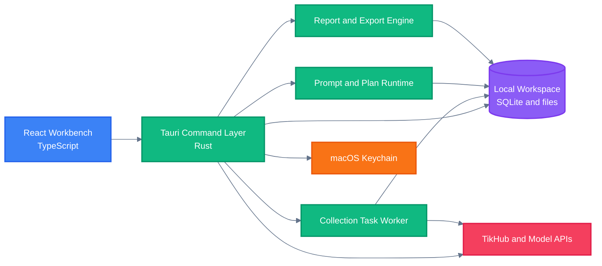

<!-- BEAUTIFIED -->

<div align="right">

<a href="README.md">English</a> · 中文

</div>

<p align="center">
  
</p>

<h1 align="center">Sortlytic</h1>

<p align="center">
  <strong>用于采集、整理、校验和导出公开社交平台研究数据的本地优先 macOS 工作区。</strong>
  <br />
  <em>TikTok · 抖音 · 小红书 · 结构化工作流 · XLSX 与 PDF 导出</em>
</p>

<p align="center">
  <a href="#快速开始"></a>
  <a href="https://github.com/ljiulong/sortlytic/releases/latest"></a>
</p>

<p align="center">
  <a href="https://github.com/ljiulong/sortlytic/actions/workflows/ci.yml"></a>
  <a href="https://github.com/ljiulong/sortlytic/releases"></a>
  
</p>

<p align="center">
  
  
  
  
  
</p>

## 功能特性

| 能力 | 作用 |
|---|---|
| 多平台采集 | 将 TikTok、抖音和小红书的关键词搜索、评论、账号资料与内容详情映射到对应的 TikHub 端点。 |
| 受控任务执行 | 执行前要求用户确认计划，并由本地任务执行器校验请求数、记录数和预算上限。 |
| 自然语言计划 | 通过当前本地规则解析器把中文研究意图转换成经过校验的采集计划，同时保存运行快照。 |
| 提示词治理 | 保存提示词模板与版本，绑定输出 Schema，并在内置回归样例失败时阻止版本激活。 |
| 本地优先安全 | 工作区数据保存在本地 SQLite，API 凭据通过作用域隔离的密钥引用写入 macOS Keychain。 |
| 可审计交付 | 生成报告快照、执行导出完整性校验，并输出带哈希和任务历史的 Excel 工作簿与 PDF 报告。 |

## 快速开始

### 环境要求

- macOS
- Node.js 24，与 CI 基线一致
- 通过 Corepack 使用 pnpm 11.5.2
- Rust 1.77.2 或更高版本

### 安装

```bash
git clone https://github.com/ljiulong/sortlytic.git
cd sortlytic/apps/macos
corepack enable
corepack install
pnpm install --frozen-lockfile
```

### 启动桌面应用

```bash
pnpm tauri dev
```

### 仅启动前端

```bash
pnpm dev
```

## 使用方法

1. **配置本地连接。** 打开设置页，保存 TikHub Token，选择适合当前网络的 TikHub API 域名并执行连通测试；同一页面也可以保存和测试模型供应商配置。
2. **创建并确认计划。** 使用表单计划器或本地自然语言解析器，检查平台范围与限制条件，然后在执行前确认计划。
3. **运行并检查任务。** 本地任务执行器处理队列步骤，保存检查点和原始记录，并展示任务日志、运行快照与校验状态。
4. **导出交付文件。** 生成报告模型，通过导出完整性门禁，并在本地工作区中创建 XLSX 与 PDF 文件。

当前自然语言计划器使用 `local-rule-engine/rule-parser-v1`。模型供应商配置和健康检查已经实现，但基于供应商模型的计划生成尚未接入。

## 架构



## 配置

### 应用身份

| 配置项 | 值 | 来源 |
|---|---|---|
| 产品名称 | `Sortlytic` | `apps/macos/src-tauri/tauri.conf.json` |
| 应用标识 | `com.steven.sortlytic` | `apps/macos/src-tauri/tauri.conf.json` |
| 默认工作区 | `default-workspace` | 创建在 macOS 应用数据目录中 |
| 本地持久化 | SQLite、原始记录、报告与导出文件 | 保存在当前活动工作区中 |
| 更新端点 | `https://github.com/ljiulong/sortlytic/releases/latest/download/latest.json` | Tauri updater 配置 |

### 应用内设置

| 配置项 | 用途 | 存储位置 |
|---|---|---|
| TikHub API 域名 | 根据当前网络选择 `api.tikhub.io` 或 `api.tikhub.dev` | 工作区数据库 |
| TikHub Token | 用于采集请求和账户状态检查 | macOS Keychain |
| 模型供应商 | 保存 API 格式、端点、地区、策略和健康状态 | 工作区数据库 |
| 模型 API Key | 用于模型供应商连通测试 | macOS Keychain |
| 默认模型配置 | 记录模型能力和当前模型选择 | 工作区数据库 |

### 发布密钥

| GitHub Actions Secret | 用途 |
|---|---|
| `TAURI_SIGNING_PRIVATE_KEY` | 为发版工作流生成的 updater 更新产物签名。 |
| `TAURI_SIGNING_PRIVATE_KEY_PASSWORD` | 在签名私钥带密码时用于解锁私钥。 |

不要把签名私钥、API Token 或导出的凭据提交到代码仓库。

## 项目结构

```text
.
├── .github/workflows/          # CI 与 macOS 发版自动化
│   ├── ci.yml                  # 前端、Rust 和依赖检查
│   └── release-macos.yml       # 版本递增、签名、打包与发布
├── apps/macos/                 # Sortlytic 桌面应用
│   ├── src/                    # React 工作台与设置界面
│   ├── src-tauri/              # Rust 命令、存储、任务执行器与打包配置
│   └── package.json            # pnpm 脚本与前端依赖
├── docs/assets/                # 仓库文档资源
│   └── sortlytic-logo.svg      # 基于应用内标识制作的 README Logo
├── excel/                      # 项目使用的表格模板
├── plan/                       # 产品、架构、测试与交付文档
├── AGENTS.md                   # 仓库协作规则
├── README.md                   # 英文文档
└── README-zh.md                # 简体中文文档
```

## 技术栈

### 界面层

| 技术 | 用途 |
|---|---|
| React 19 | 桌面工作台与设置界面 |
| TypeScript 6 | 前端类型与 Tauri 命令契约 |
| Vite 8 | 前端开发和生产构建 |
| TanStack Query 与 Table | 服务状态协调与表格数据展示 |
| React Hook Form 与 Zod | 表单状态和输入校验 |
| Radix Tabs 与 Lucide | 无障碍导航基础组件与界面图标 |

### 桌面端与数据层

| 技术 | 用途 |
|---|---|
| Tauri 2 | macOS 原生应用外壳与命令桥接 |
| Rust | 工作区、采集、任务、提示词、安全和导出逻辑 |
| SQLite 与 rusqlite | 本地事务型工作区存储 |
| macOS Keychain | 通过作用域密钥引用保存 API 凭据 |
| reqwest | TikHub 与模型供应商连通请求 |
| rust_xlsxwriter | 原生 XLSX 报告生成 |

### 质量与交付

| 技术 | 用途 |
|---|---|
| Vitest | 前端单元测试 |
| Oxlint | 前端静态检查 |
| Cargo fmt、test 与 Clippy | Rust 格式、测试和 lint 检查 |
| GitHub Actions | CI、版本管理、双架构 macOS 构建与发版 |
| Tauri updater | 已签名更新元数据和可下载应用产物 |

## 部署与发布

### 本地验证

```bash
cd apps/macos
pnpm lint
pnpm test
pnpm build
```

```bash
cd apps/macos/src-tauri
cargo fmt --all -- --check
cargo check --locked --all-targets --all-features
cargo test --locked --all-targets --all-features
cargo clippy --locked --all-targets --all-features -- -D warnings
```

### 构建 macOS 产物

```bash
cd apps/macos
pnpm build:mac
```

本地构建 updater 更新产物时，需要配置 `TAURI_SIGNING_PRIVATE_KEY`；私钥带密码时还需要 `TAURI_SIGNING_PRIVATE_KEY_PASSWORD`。

### 发布新版本

手动运行 [`release-macos`](.github/workflows/release-macos.yml) 工作流，并选择 patch、minor 或 major 版本递增。工作流会同步 `package.json`、`tauri.conf.json` 和 `Cargo.toml`，创建 `app-vX.Y.Z` 标签，然后分别构建 Apple Silicon 与 Intel 的 `.app` 和 `.dmg` 产物并发布到 GitHub Release。

## 贡献

1. Fork 本仓库。
2. 创建边界清晰的分支：`git checkout -b feature/short-description`。
3. 完成修改并运行相关前端与 Rust 检查。
4. 只提交本次范围内的文件。
5. 推送分支并创建 Pull Request。

当前仓库没有 LICENSE 文件。正式分发或按明确条款接收外部贡献前，应先添加许可证。
