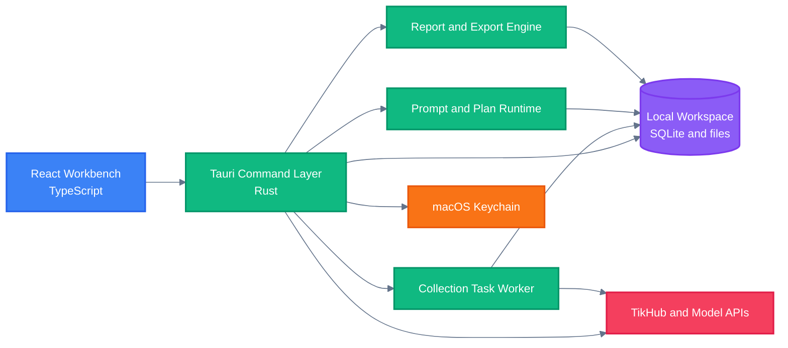

<!-- BEAUTIFIED -->

<div align="right">

English · <a href="README-zh.md">中文</a>

</div>

<p align="center">
  
</p>

<h1 align="center">Sortlytic</h1>

<p align="center">
  <strong>A local-first macOS workspace for collecting, organizing, validating, and exporting public social-platform research.</strong>
  <br />
  <em>TikTok · Douyin · Xiaohongshu · Structured workflows · XLSX and PDF exports</em>
</p>

<p align="center">
  <a href="#quick-start"></a>
  <a href="https://github.com/ljiulong/sortlytic/releases/latest"></a>
</p>

<p align="center">
  <a href="https://github.com/ljiulong/sortlytic/actions/workflows/ci.yml"></a>
  <a href="https://github.com/ljiulong/sortlytic/releases"></a>
  
</p>

<p align="center">
  
  
  
  
  
</p>

## Features

| Capability | What it provides |
|---|---|
| Multi-platform collection | Maps keyword search, comments, account profiles, and item details to supported TikHub endpoints for TikTok, Douyin, and Xiaohongshu. |
| Controlled task execution | Requires plan confirmation and enforces request, record, and budget limits before the local worker executes a task. |
| Natural-language planning | Converts Chinese research intent into a validated collection plan through the current local rule parser and records its runtime snapshot. |
| Prompt governance | Stores prompt templates and versions, binds output schemas, and blocks activation when built-in regression cases fail. |
| Local-first security | Keeps workspace data in local SQLite storage and stores API credentials in macOS Keychain through scoped secret references. |
| Auditable delivery | Builds report snapshots, validates export integrity, and writes structured Excel workbooks and PDF reports with hashes and job history. |

## Quick Start

### Prerequisites

- macOS
- Node.js 24, matching the CI baseline
- pnpm 11.5.2 through Corepack
- Rust 1.77.2 or newer

### Install

```bash
git clone https://github.com/ljiulong/sortlytic.git
cd sortlytic/apps/macos
corepack enable
corepack install
pnpm install --frozen-lockfile
```

### Run the desktop app

```bash
pnpm tauri dev
```

### Run the frontend only

```bash
pnpm dev
```

## Usage

1. **Configure local connections.** Open Settings, save a TikHub token, select the appropriate TikHub API domain, and run the connection test. Model provider profiles can also be stored and tested from the same page.
2. **Create and confirm a plan.** Use the form planner or the local natural-language parser, review platform scope and limits, then confirm the plan before execution.
3. **Run and inspect the task.** The local worker processes queued steps, persists checkpoints and raw records, and exposes task logs, runtime snapshots, and validation status.
4. **Export deliverables.** Build a report model, pass the export integrity gate, and generate XLSX and PDF files under the local workspace.

The current natural-language planner uses `local-rule-engine/rule-parser-v1`. Model provider configuration and health checks are implemented, but provider-backed plan generation is not connected yet.

## Architecture



## Configuration

### Application identity

| Setting | Value | Source |
|---|---|---|
| Product name | `Sortlytic` | `apps/macos/src-tauri/tauri.conf.json` |
| Application identifier | `com.steven.sortlytic` | `apps/macos/src-tauri/tauri.conf.json` |
| Default workspace | `default-workspace` | Created under the macOS app data directory |
| Local persistence | SQLite, raw records, reports, and exports | Stored inside the active workspace |
| Updater endpoint | `https://github.com/ljiulong/sortlytic/releases/latest/download/latest.json` | Tauri updater configuration |

### In-app settings

| Setting | Purpose | Storage |
|---|---|---|
| TikHub API domain | Selects `api.tikhub.io` or `api.tikhub.dev` for the current network | Workspace database |
| TikHub token | Authenticates collection and account checks | macOS Keychain |
| Model provider | Stores provider format, endpoint, region, policies, and health status | Workspace database |
| Model API key | Authenticates provider connection tests | macOS Keychain |
| Default model profile | Records model capabilities and the active model choice | Workspace database |

### Release secrets

| GitHub Actions secret | Purpose |
|---|---|
| `TAURI_SIGNING_PRIVATE_KEY` | Signs updater artifacts produced by the release workflow. |
| `TAURI_SIGNING_PRIVATE_KEY_PASSWORD` | Unlocks the updater signing key when the key is password-protected. |

Do not commit signing keys, API tokens, or exported credentials to the repository.

## Project Structure

```text
.
├── .github/workflows/          # CI and macOS release automation
│   ├── ci.yml                  # Frontend, Rust, and dependency checks
│   └── release-macos.yml       # Version bump, signing, packaging, and publishing
├── apps/macos/                 # Sortlytic desktop application
│   ├── src/                    # React workbench and settings interfaces
│   ├── src-tauri/              # Rust commands, storage, workers, and bundling
│   └── package.json            # pnpm scripts and frontend dependencies
├── docs/assets/                # Repository documentation assets
│   └── sortlytic-logo.svg      # README logo derived from the in-app mark
├── excel/                      # Spreadsheet templates used by the project
├── plan/                       # Product, architecture, testing, and delivery notes
├── AGENTS.md                   # Repository collaboration rules
├── README.md                   # English documentation
└── README-zh.md                # Simplified Chinese documentation
```

## Tech Stack

### Interface

| Technology | Purpose |
|---|---|
| React 19 | Desktop workbench and settings UI |
| TypeScript 6 | Frontend types and Tauri command contracts |
| Vite 8 | Frontend development and production builds |
| TanStack Query and Table | Server-state coordination and tabular presentation |
| React Hook Form and Zod | Form state and input validation |
| Radix Tabs and Lucide | Accessible navigation primitives and interface icons |

### Desktop and data

| Technology | Purpose |
|---|---|
| Tauri 2 | Native macOS application shell and command bridge |
| Rust | Workspace, collection, task, prompt, security, and export logic |
| SQLite and rusqlite | Local transactional workspace storage |
| macOS Keychain | API credential storage through scoped key references |
| reqwest | TikHub and provider connection requests |
| rust_xlsxwriter | Native XLSX report generation |

### Quality and delivery

| Technology | Purpose |
|---|---|
| Vitest | Frontend unit tests |
| Oxlint | Frontend static analysis |
| Cargo fmt, test, and Clippy | Rust formatting, tests, and lint checks |
| GitHub Actions | CI, versioning, dual-architecture macOS builds, and releases |
| Tauri updater | Signed update metadata and downloadable application artifacts |

## Deployment

### Validate locally

```bash
cd apps/macos
pnpm lint
pnpm test
pnpm build
```

```bash
cd apps/macos/src-tauri
cargo fmt --all -- --check
cargo check --locked --all-targets --all-features
cargo test --locked --all-targets --all-features
cargo clippy --locked --all-targets --all-features -- -D warnings
```

### Build macOS artifacts

```bash
cd apps/macos
pnpm build:mac
```

Local updater builds require `TAURI_SIGNING_PRIVATE_KEY` and, when applicable, `TAURI_SIGNING_PRIVATE_KEY_PASSWORD`.

### Publish a release

Run the [`release-macos`](.github/workflows/release-macos.yml) workflow manually and select a patch, minor, or major version bump. The workflow synchronizes `package.json`, `tauri.conf.json`, and `Cargo.toml`, creates an `app-vX.Y.Z` tag, then builds Apple Silicon and Intel `.app` and `.dmg` artifacts before publishing the GitHub Release.

## Contributing

1. Fork the repository.
2. Create a focused branch: `git checkout -b feature/short-description`.
3. Make the change and run the relevant frontend and Rust checks.
4. Commit only the files in scope.
5. Push the branch and open a Pull Request.

No LICENSE file is currently present. Add a LICENSE before distributing or accepting external contributions under defined terms.
