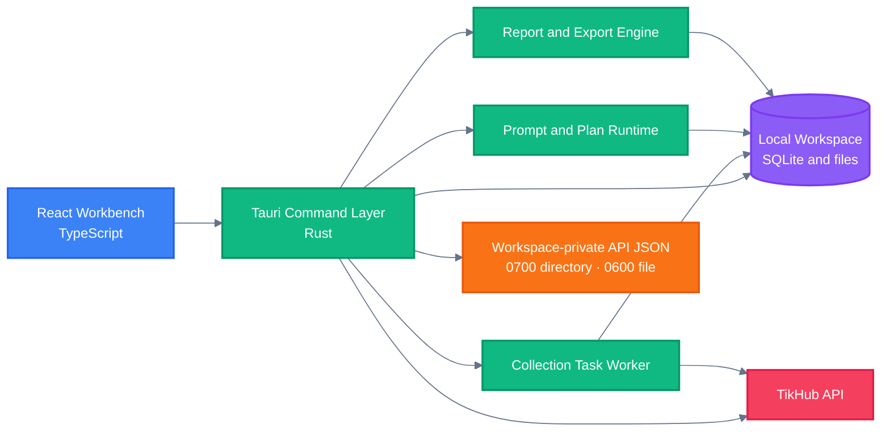

<!-- BEAUTIFIED -->

<div align="right">

English · <a href="README-zh.md">中文</a>

</div>

<p align="center">
  
</p>

<h1 align="center">Sortlytic</h1>

<p align="center">
  <strong>A local-first macOS workspace for collecting, organizing, validating, and exporting public social-platform research.</strong>
  <br />
  <em>TikTok · Douyin · Xiaohongshu · Structured workflows · XLSX and PDF exports</em>
</p>

<p align="center">
  <a href="#quick-start"></a>
  <a href="https://github.com/ljiulong/sortlytic/releases/latest"></a>
</p>

<p align="center">
  <a href="https://github.com/ljiulong/sortlytic/actions/workflows/ci.yml"></a>
  <a href="https://github.com/ljiulong/sortlytic/releases"></a>
  
</p>

<p align="center">
  
  
  
  
  
</p>

## Features

| Capability | What it provides |
|---|---|
| Multi-platform collection | Combines keyword search, item details, account profiles, account posts, and comments across TikTok, Douyin, and Xiaohongshu. |
| Controlled task execution | Checks live endpoint quotes, free credit, paid balance, request limits, record limits, and the task budget before and during collection. |
| Natural-language planning | Converts Chinese research intent into a validated collection plan through the current local rule parser and records its runtime snapshot. |
| Prompt governance | Stores prompt templates and versions, binds output schemas, and blocks activation when built-in regression cases fail. |
| Local-first security | Keeps workspace data in local SQLite storage and stores TikHub and AI API profiles in a workspace-private JSON registry. |
| Auditable delivery | Builds report snapshots, validates export integrity, and writes structured Excel workbooks and PDF reports with hashes and job history. |

## Quick Start

### Download the macOS app

1. Open the [latest GitHub Release](https://github.com/ljiulong/sortlytic/releases/latest).
2. Check your Mac architecture from **Apple menu → About This Mac**, or run `uname -m` in Terminal.
3. Download the DMG whose name ends in `_aarch64.dmg` for Apple Silicon (`arm64`), or `_x64.dmg` for an Intel Mac (`x86_64`). The `.app.tar.gz` and `.sig` files are updater artifacts, not the normal installer.
4. Open the DMG, drag Sortlytic into **Applications**, eject the disk image, and launch Sortlytic from the Applications folder.

The current release workflow does not yet apply Apple Developer ID signing and notarization. Read [First launch and the “damaged” alert](#first-launch-and-the-damaged-alert) before overriding any macOS security warning.

### Run from source

Source development requires macOS, Node.js 24, pnpm 11.5.2 through Corepack, and Rust 1.88 or newer.

```bash
git clone https://github.com/ljiulong/sortlytic.git
cd sortlytic/apps/macos
corepack enable
corepack install
pnpm install --frozen-lockfile
pnpm tauri dev
```

For interface preview without the native backend, run:

```bash
pnpm dev
```

The browser preview uses demonstration data. It cannot access the workspace-private API registry, execute native collection tasks, create local exports, or install application updates.

## Usage

### First launch and the “damaged” alert

The current `v0.1.5` release contains Tauri updater signatures, but the GitHub Actions workflow does not yet contain the Apple Developer ID certificate and notarization credentials required by macOS Gatekeeper. Tauri documents that browser-downloaded macOS apps need code signing to avoid the “application is damaged and can’t be opened” warning. Updater signatures verify update artifacts inside Sortlytic; they do not replace Apple code signing or notarization.

If macOS shows the alert in the screenshot:

1. Delete the rejected copy and download the correct DMG again from the [official Sortlytic Releases page](https://github.com/ljiulong/sortlytic/releases). Do not use a mirror or a file forwarded through chat.
2. Confirm that `_aarch64.dmg` matches Apple Silicon or `_x64.dmg` matches an Intel Mac.
3. Try to open Sortlytic once, then open **System Settings → Privacy & Security**. If **Open Anyway** is available, use it only after confirming the download source. Apple notes that this exception is normally offered for about one hour after an attempted launch.
4. If macOS still reports that the app is damaged or does not offer **Open Anyway**, and you have verified that the app came from the official Release, remove the quarantine attribute from Sortlytic only and launch it again:

   ```bash
   xattr -dr com.apple.quarantine "/Applications/Sortlytic.app"
   open "/Applications/Sortlytic.app"
   ```

   These commands do not disable Gatekeeper globally. They remove the download quarantine attribute only from this app bundle. `sudo` is normally unnecessary; if Terminal reports `Permission denied`, run only the `xattr` command again with `sudo`.
5. If the app still cannot open after the targeted removal, delete it and recheck the architecture and download integrity. Run from source or wait for a Developer ID-signed and notarized release instead of using `sudo spctl --master-disable` or another system-wide bypass.

See [Apple’s Gatekeeper guidance](https://support.apple.com/102445) and [Tauri’s macOS signing guide](https://v2.tauri.app/distribute/sign/macos/) for the security model and release requirements.

### Interface map

| Area | Use it for |
|---|---|
| Workbench | Create plans, confirm collection, follow task status, review data and evidence, and export deliverables. |
| Settings | Inspect the local workspace, configure TikHub and model providers, retest connections, and install updates. |
| Guide button | Open the book icon in the top-right corner for TikHub registration, token, domain, cost, and safety guidance. |
| Theme button | Switch between light and dark themes; the preference is retained locally. |

### Configure TikHub

TikHub is required for real collection. Create and verify an account before building a task:

1. [Register a TikHub account](https://user.tikhub.io/register), verify the email address, then [sign in to the user center](https://user.tikhub.io/login).
2. Create an API Token in the user center and copy it when shown. Check the [TikHub pricing page](https://tikhub.io/pricing) before using paid endpoints.
3. In Sortlytic, open **Settings → Configure TikHub API**.
4. Select a domain, paste the token, and choose **Save and Test**. The dialog keeps a list of saved profiles so you can add another account or switch the current profile later.

| Network | API domain |
|---|---|
| International network | `https://api.tikhub.io` |
| Mainland China network | `https://api.tikhub.dev` |

A successful test displays the masked account email, paid balance, free credit, their available total, and email verification status. The token is stored in plaintext inside the workspace-private `secrets/api-config.json`; SQLite keeps only a rebuildable mirror and scoped credential-reference metadata. The first valid TikHub profile becomes current automatically. Later profiles are saved without replacing it until you explicitly choose **Set as Current**. When editing an existing configuration, leave the token field empty to reuse the saved token.

Start the first collection with 10–50 records. This makes it easier to verify the platform, data type, region, keyword, and endpoint cost before expanding the task.

### Configure a model provider (optional)

Open **Settings → Configure AI API** to store OpenAI, Anthropic, Gemini, custom OpenAI-compatible, or Ollama profiles. Select the API format, fill in the Base URL when required, enter the default model ID and API key, then choose **Save and Test**. Ollama may be saved without a key. The dialog supports multiple profiles, including multiple accounts or endpoints for the same provider, and lets you switch the current profile. Keys are stored in the same workspace-private JSON registry and can be retained by leaving the key field empty while editing.

This configuration is optional in the current MVP. AI profile testing validates only the protocol, address, model, and key requirements; it does not call the model provider. Natural-language planning still uses `local-rule-engine/rule-parser-v1`; provider-backed plan generation and real model inference are not connected yet.

### Create and confirm a collection plan

Open **Workbench → Collection Builder** and choose an entry method:

| Method | When to use it | Required review |
|---|---|---|
| Form | You already know the platform, data types, country or region, keyword, optional audience filters, record limit, and budget. | Confirm every field before generating the plan. |
| Natural language | You want to describe the research goal in Chinese and let the local parser structure it. | Check inferred platforms, data types, filters, missing conditions, record limits, and budget. |

The form supports TikTok, Douyin, and Xiaohongshu. Select one or more output types: keyword-search accounts, item or note authors, public account profiles, accounts owning collected posts, and comment users. Sortlytic uses the keyword as the entry point and adds the required downstream steps automatically; dependency-only search rows do not count toward the output limit.

| Filter | Behavior |
|---|---|
| Country or region | Search a single dropdown by Chinese name or two-letter code. The stored value is the code. Unsupported steps never receive the parameter; the control is disabled when none of the selected steps support it. |
| Age | Optional closed range from 0 to 130. Sortlytic accepts only an explicit age returned by TikHub or public profile data. Unknown or malformed ages are excluded while this filter is active. |
| Gender | Optional multi-select filter. Sortlytic accepts only an explicit gender returned by TikHub or public profile data and never infers it from a name, avatar, biography, or content. |

A single task accepts 10–5,000 qualified, deduplicated account rows and a budget value from 1–500. Accounts are deduplicated by platform and stable platform user ID, with normalized account identity as the fallback.

After selecting **Generate Plan** or **Parse into Plan**:

1. Review the plan preview, especially platform, output types, supported filters, maximum qualified records, request estimate, live quote, and amount limit.
2. Resolve the first reason shown beside **Confirm Run**. Invalid filters, unsupported parameters, unknown pricing, unknown balance, insufficient total credit, or an exceeded budget all block confirmation.
3. Select **Confirm Run**. Planning itself does not start paid collection; confirmation adds the task to the local queue.
4. Follow the task in **Task Queue**. Possible states include queued, running, waiting for confirmation, partially successful, successful, and failed. A failed target does not stop unrelated targets; qualified output plus target failures finishes as partially successful.

### Review results and evidence

Select a row under **Data Assets** to inspect its source link, evidence summary, validation state, confidence, model run, and transformation reason in the right-hand panel. Records marked **Manual Confirmation** or **Insufficient Evidence** should be checked before they are used in a report.

Current MVP boundary: native tasks and raw-record storage are implemented, but the workbench’s real-record query is not connected yet. In a packaged backend session, **Data Assets** may therefore remain empty even after a task runs. Browser preview rows are demonstration data and are not collection results.

### Export Excel and PDF

1. Create at least one collection task.
2. In the right-hand **Export Center**, select **Run Export Check**.
3. Sortlytic builds a report snapshot, validates the export request, and creates both XLSX and PDF jobs.
4. When both jobs show **Passed**, use the paths displayed under **Excel Workbook** and **PDF Report** to locate the files.

Files are written under the active workspace:

```text
default-workspace/
├── app.sqlite
├── raw/tikhub/
├── reports/
├── exports/excel/
└── exports/pdf/
```

The XLSX account export follows `excel/社交平台用户数据收集模板_国家地区版.xlsx`. It keeps only the four template sheets (`用户数据收集表`, `填写说明`, `字段枚举`, and `资料依据`), preserves the 18-column account layout, writes age as a number, and retains at least 200 formatted data rows. Larger results extend formulas, styles, and validation. Raw responses and target failures remain in the local evidence store and run logs instead of being added as workbook sheets.

The current PDF writer produces a short summary that points readers to the workbook for complete structured data. **Webhook Summary** is visible in the interface but is not enabled and does not send data.

### Update the app

Packaged releases can update from **Settings → Automatic Updates**:

1. Select **Check for Updates**.
2. Review the version number and release notes.
3. Select **Download and Restart**. Sortlytic verifies the Tauri updater artifact signature, installs the update, and relaunches.

Browser preview does not have update permission. Apple Developer ID signing and notarization are separate from updater signature verification and still need to be added to the release workflow.

### Troubleshooting

| Symptom | Check |
|---|---|
| “Sortlytic is damaged and can’t be opened” | Re-download the matching DMG from the official release, then follow [First launch and the “damaged” alert](#first-launch-and-the-damaged-alert). |
| TikHub test fails | Check that the token is complete, the email is verified, the domain matches the current network, and the account has enough credit. |
| **Save and Test** is disabled | A new TikHub token must contain at least 8 characters. An existing saved token can be reused by leaving the field empty. |
| A plan cannot be confirmed | Read the first blocker beside the button. Correct invalid filters or unsupported inputs, refresh TikHub credit and live pricing, then confirm that the available total covers the quoted budget. |
| Export fails | Create a task first. Then read the message below the workspace title for the backend error and retry after the task data is available. |
| The screen shows realistic records but no native features work | The app is running through `pnpm dev` in browser demonstration mode. Start it with `pnpm tauri dev` or use the packaged app. |
| No **Open Anyway** button appears | Re-attempt the launch and check Privacy & Security within one hour. For the verified official build, use the targeted `xattr` command above; do not disable Gatekeeper globally. |

### Data and security boundaries

- Sortlytic currently creates one local `default-workspace`; it does not provide user accounts, a remote database, remote synchronization, or multi-device synchronization.
- Workspace data, raw responses, prompt snapshots, logs, reports, and exports remain under the macOS application data directory.
- TikHub and AI API profiles are the only source of truth in `~/Library/Application Support/com.steven.sortlytic/default-workspace/secrets/api-config.json`. The `secrets` directory is restricted to mode `0700`, and the JSON file to `0600`; the application refuses symbolic links, non-regular files, or storage that cannot enforce these private permissions.
- API keys are plaintext in that JSON file. The permissions restrict other local users, but they cannot stop malicious processes running under the same macOS account from reading it.
- Plaintext API keys are not copied into SQLite, logs, exports, Webhook payloads, or application backups. SQLite contains only rebuildable profile mirrors, credential-reference metadata, audits, and immutable task snapshots without the key itself.
- This workspace-private JSON design supersedes earlier documentation that required API keys to be stored in macOS Keychain.
- Migration does not read or delete legacy macOS Keychain entries, so it does not trigger a Keychain access prompt. Imported legacy profiles are marked **Re-enter Required** and require the TikHub token or AI API key to be entered once in the corresponding dialog. Old Keychain entries remain available for manual cleanup or rollback.
- Deleting the application does not necessarily remove the workspace or legacy Keychain entries. Back up required XLSX, PDF, and raw files before manually deleting application data; do not copy `secrets/api-config.json` into a shared backup.
- Only collect public data that you are permitted to access, and follow platform terms, privacy requirements, and applicable law.

## Architecture



## Configuration

### Application identity

| Setting | Value | Source |
|---|---|---|
| Product name | `Sortlytic` | `apps/macos/src-tauri/tauri.conf.json` |
| Application identifier | `com.steven.sortlytic` | `apps/macos/src-tauri/tauri.conf.json` |
| Default workspace | `default-workspace` | Created under the macOS app data directory |
| Local persistence | SQLite, raw records, reports, and exports | Stored inside the active workspace |
| API profile registry | TikHub and AI profiles plus plaintext credentials | `secrets/api-config.json` inside the active workspace |
| Updater endpoint | `https://github.com/ljiulong/sortlytic/releases/latest/download/latest.json` | Tauri updater configuration |

### In-app settings

| Setting | Purpose | Storage |
|---|---|---|
| TikHub profiles | Stores named accounts, domains, validation summaries, and the current profile | Private API registry JSON |
| TikHub token | Authenticates collection and account checks | Plaintext credential in private API registry JSON |
| AI profiles | Stores named providers, API formats, endpoints, default models, validation status, and the current profile | Private API registry JSON |
| AI API key | Satisfies local AI profile validation; Ollama may omit it | Plaintext credential in private API registry JSON |
| Runtime profile mirror | Supports internal queries and immutable task binding without plaintext keys | Workspace SQLite database |

### Release secrets

| GitHub Actions secret | Purpose |
|---|---|
| `TAURI_SIGNING_PRIVATE_KEY` | Signs updater artifacts produced by the release workflow. |
| `TAURI_SIGNING_PRIVATE_KEY_PASSWORD` | Unlocks the updater signing key when the key is password-protected. |

Do not commit signing keys, API tokens, or exported credentials to the repository.

## Project Structure

```text
.
├── .github/workflows/          # CI and macOS release automation
│   ├── ci.yml                  # Frontend, Rust, and dependency checks
│   └── release-macos.yml       # Version bump, signing, packaging, and publishing
├── apps/macos/                 # Sortlytic desktop application
│   ├── src/                    # React workbench and settings interfaces
│   ├── src-tauri/              # Rust commands, storage, workers, and bundling
│   └── package.json            # pnpm scripts and frontend dependencies
├── excel/                      # Spreadsheet templates used by the project
├── plan/                       # Product, architecture, testing, and delivery notes
├── AGENTS.md                   # Repository collaboration rules
├── README.md                   # English documentation
└── README-zh.md                # Simplified Chinese documentation
```

## Tech Stack

### Interface

| Technology | Purpose |
|---|---|
| React 19 | Desktop workbench and settings UI |
| TypeScript 6 | Frontend types and Tauri command contracts |
| Vite 8 | Frontend development and production builds |
| TanStack Query and Table | Server-state coordination and tabular presentation |
| React Hook Form and Zod | Form state and input validation |
| Radix Tabs and Lucide | Accessible navigation primitives and interface icons |

### Desktop and data

| Technology | Purpose |
|---|---|
| Tauri 2 | Native macOS application shell and command bridge |
| Rust | Workspace, collection, task, prompt, security, and export logic |
| SQLite and rusqlite | Local transactional workspace storage |
| Private JSON registry | API profile and plaintext credential storage with `0700` directory and `0600` file permissions |
| reqwest | TikHub account tests and collection requests |
| rust_xlsxwriter | Native XLSX report generation |

### Quality and delivery

| Technology | Purpose |
|---|---|
| Vitest | Frontend unit tests |
| Oxlint | Frontend static analysis |
| Cargo fmt, test, and Clippy | Rust formatting, tests, and lint checks |
| GitHub Actions | CI, versioning, dual-architecture macOS builds, and releases |
| Tauri updater | Signed update metadata and downloadable application artifacts |

## Deployment

### Validate locally

```bash
cd apps/macos
pnpm lint
pnpm test
pnpm build
```

```bash
cd apps/macos/src-tauri
cargo fmt --all -- --check
cargo check --locked --all-targets --all-features
cargo test --locked --all-targets --all-features
cargo clippy --locked --all-targets --all-features -- -D warnings
```

### Build macOS artifacts

```bash
cd apps/macos
pnpm build:mac
```

Local updater builds require `TAURI_SIGNING_PRIVATE_KEY` and, when applicable, `TAURI_SIGNING_PRIVATE_KEY_PASSWORD`.

### Publish a release

Every push to `main` runs [`release-macos`](.github/workflows/release-macos.yml) after CI passes. semantic-release derives the version from Conventional Commits: `fix` and `revert` produce a patch release, `feat` produces a minor release, and a `BREAKING CHANGE` produces a major release. The workflow synchronizes `package.json`, `tauri.conf.json`, and `Cargo.toml`, creates the `app-vX.Y.Z` tag as a draft release, builds signed updater files plus Apple Silicon and Intel `.app` and `.dmg` artifacts, and publishes the release only after both architectures succeed. Manual dispatch accepts only an optional existing `app-vX.Y.Z` tag through `rebuild_tag` to rebuild its artifacts.

#### What semantic-release owns

For a normal push to `main`, `semantic-release` is responsible for the release decision and release metadata:

- It analyzes English Conventional Commit titles to decide whether a release is needed and whether the next version is a patch, minor, or major release.
- It assigns the next version and synchronizes the application version in `apps/macos/package.json`, `apps/macos/src-tauri/tauri.conf.json`, `apps/macos/src-tauri/Cargo.toml`, and `apps/macos/src-tauri/Cargo.lock`.
- It creates the `app-vX.Y.Z` Git tag.
- It generates the release notes and creates the draft GitHub Release named `Sortlytic vX.Y.Z`.

Release-relevant commit titles must be written in English and use the Conventional Commits format. Use titles such as `feat: add a collection target`, `fix: preserve the request limit`, or `revert: ...`. Add a `BREAKING CHANGE: ...` footer when the change requires a major release. Do not choose a release number, tag, or release notes manually; the configured `semantic-release` plugins own those values.

#### Build and publication order

The normal workflow publishes only after the complete release pipeline succeeds:

1. `verify` runs the reusable CI workflow against the pushed commit.
2. `release` runs `semantic-release`. If it creates a new release, the workflow checks out the resulting tag and keeps the GitHub Release in draft state.
3. `build-and-release` runs a macOS matrix for `aarch64-apple-darwin` (Apple Silicon) and `x86_64-apple-darwin` (Intel). Each job builds and uploads `.app` and `.dmg` bundles plus the Tauri updater artifacts to the same tagged draft Release. The two jobs use `--bundles app,dmg`; updater artifacts are enabled by `src-tauri/tauri.conf.json`.
4. `finalize-release` rewrites `latest.json` to use direct GitHub Release download URLs, copies the Release notes into the manifest, verifies that both platform entries have non-empty signatures, uploads the normalized manifest, and marks the draft Release as the latest public release.

If `semantic-release` finds no release-worthy commit, the build matrix is skipped. A release is not made public while either macOS architecture is missing or failed.

#### Updater verification and in-app installation

The Tauri updater uses the public key and `latest.json` endpoint configured in `apps/macos/src-tauri/tauri.conf.json`. The release finalization check requires a non-empty signature for every platform entry. In a packaged Sortlytic app, open **Settings → Automatic Updates**, select **Check for Updates**, review the version and Release notes, then select **Download and Restart**. The updater downloads and installs the signed artifact and relaunches the app. Browser preview does not have the updater permission; Apple Developer ID signing and notarization are a separate macOS distribution concern.

#### Recovery rebuilds with `rebuild_tag`

Use **Run workflow** with `rebuild_tag` only when rebuilding an existing release. The value must match `app-vX.Y.Z`; the workflow verifies that the Git tag and the corresponding GitHub Release exist, checks out that tag for CI and packaging, and skips `semantic-release`. It then rebuilds both macOS targets, uploads the artifacts to the existing Release, and refreshes its updater manifest without creating a new version, tag, or Release. The normal draft-publication command is skipped for this recovery path.

#### Apple signing and notarization boundary

The current workflow expects `TAURI_SIGNING_PRIVATE_KEY` and `TAURI_SIGNING_PRIVATE_KEY_PASSWORD` for updater artifact signing, but it does not configure an Apple Developer ID certificate or notarization credentials. Updater signatures authenticate the updater artifacts; they do not replace Apple code signing or notarization, and they do not guarantee that Gatekeeper will accept a browser-downloaded app. Download only from the official Sortlytic Release, select the DMG that matches the Mac architecture, and follow [First launch and the “damaged” alert](#first-launch-and-the-damaged-alert) if macOS blocks the app. Do not disable Gatekeeper system-wide.

## Contributing

1. Fork the repository.
2. Create a focused branch: `git checkout -b feature/short-description`.
3. Make the change and run the relevant frontend and Rust checks.
4. Commit only the files in scope.
5. Push the branch and open a Pull Request.

No LICENSE file is currently present. Add a LICENSE before distributing or accepting external contributions under defined terms.
